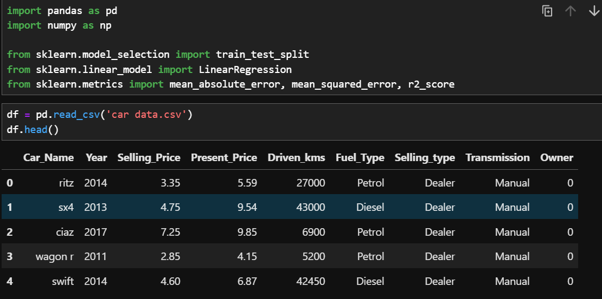
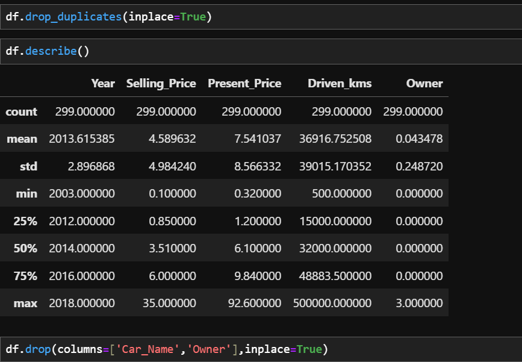
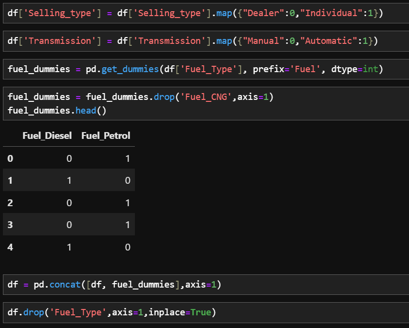
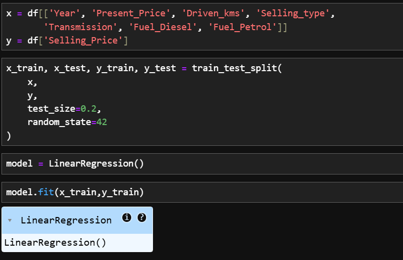
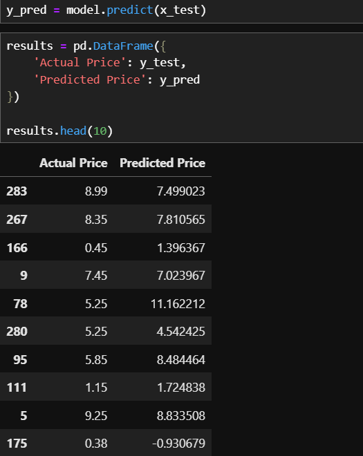
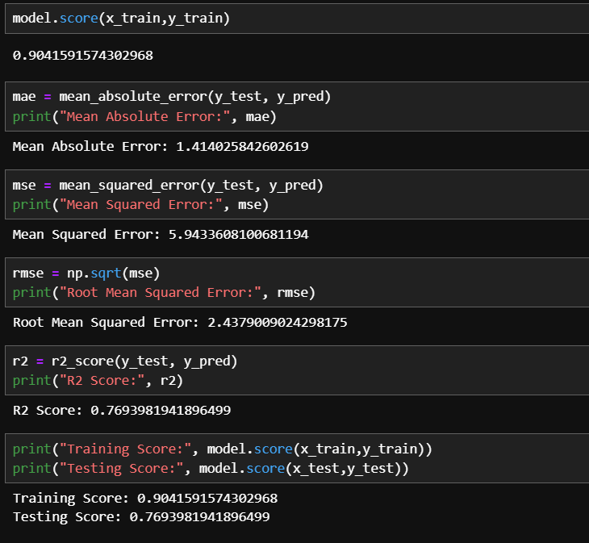

# 🚗 Car Price Prediction — Machine Learning Model

Training pipeline for a **Multiple Linear Regression** model that predicts the selling price of used cars from engineered features.

[]()
[]()
[]()
[]()

> 📦 **Deployed as a live Flask web app:** [car-price-prediction-webapp](https://github.com/NADEEMAHMED770/car-price-prediction-webapp)

---

## 🎯 Overview

This project covers the complete ML training workflow for the car price prediction system:

- Data cleaning and preprocessing
- Feature engineering (encoding categorical variables)
- Train-test split
- Multiple Linear Regression model training
- Evaluation using MAE, MSE, RMSE, and R²

The resulting model is exported via **Joblib** and deployed in the companion Flask web app.

---

## 🤖 Model Details

| Field | Value |
|---|---|
| Algorithm | Multiple Linear Regression |
| Target Variable | Selling Price |
| Features | 7 encoded features |
| Training R² | 0.90 |
| **Test R²** | **0.77** |
| MAE | 1.41 |
| RMSE | 2.44 |

### On the Train/Test Gap

The model shows a **train R² of 0.90** and **test R² of 0.77** — a gap that indicates mild overfitting, which is expected for linear regression on a small dataset with limited feature complexity. Future improvements (see below) focus on closing this gap.

---

## 🔄 Workflow

### 1. Data Cleaning
- Removed duplicate records
- Dropped unnecessary columns (`Car_Name`, `Owner`)
- Checked and handled missing values

### 2. Feature Engineering
- Label-encoded `Selling_type` (Dealer → 0, Individual → 1)
- Label-encoded `Transmission` (Manual → 0, Automatic → 1)
- One-Hot Encoded `Fuel_Type` (dropped `Fuel_CNG` to avoid multicollinearity)

### 3. Model Development
- Train-test split (80/20, `random_state=42`)
- Multiple Linear Regression (`LinearRegression()` from scikit-learn)
- Predictions on test data

### 4. Model Evaluation
- Mean Absolute Error (MAE)
- Mean Squared Error (MSE)
- Root Mean Squared Error (RMSE)
- R² Score

---

## 📸 Walkthrough

### 1. Load & Inspect Data


### 2. Data Cleaning


### 3. Feature Engineering


### 4. Train-Test Split & Training


### 5. Predictions vs Actual


### 6. Model Evaluation Metrics


---

## 🛠️ Tech Stack

| Category | Tools |
|---|---|
| Language | Python |
| ML Library | scikit-learn |
| Data Handling | Pandas, NumPy |
| Visualization | Matplotlib, Seaborn |
| Environment | Jupyter Notebook |
| Model Persistence | Joblib |

---

## 📂 Project Structure

```
car_price_prediction/
│
├── car data.csv
├── car_price_prediction.ipynb
├── requirements.txt
│
├── images/
│   ├── 1.png
│   ├── 2.png
│   ├── 3.png
│   ├── 4.png
│   ├── 5.png
│   └── 6.png
│
└── README.md
```

---

## 🚀 Future Improvements

- Compare with Random Forest Regressor
- Compare with XGBoost Regressor
- **Reduce overfitting** via regularization (Ridge/Lasso) and cross-validation
- Hyperparameter tuning
- Feature importance analysis
- REST API deployment (FastAPI)
- Streamlit dashboard for interactive exploration

---

## 🔗 Related Project

The trained model is deployed in a live web app:

👉 **[car-price-prediction-webapp](https://github.com/NADEEMAHMED770/car-price-prediction-webapp)** — Flask + scikit-learn deployment

---

## 📬 Contact

**Nadeem Ahmed Ghoto**
BS Artificial Intelligence Student | Aspiring AI/ML Engineer

- GitHub: [@NADEEMAHMED770](https://github.com/NADEEMAHMED770)
- LinkedIn: [Nadeem Ahmed](https://www.linkedin.com/in/nadeem-ahmed-15033a328/)
- Kaggle: [nadeemahmedghoto](https://www.kaggle.com/nadeemahmedghoto)
